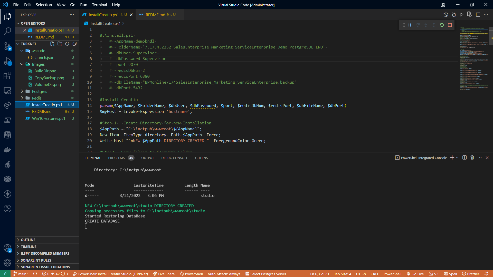

# How to install Creatio on Windows

## Download Creatio
Download [Creatio Archive](https://ftp.bpmonline.com/support/downloads/!Release/installation_files/7.18.5/7.18.5.1500_Studio_Softkey_PostgreSQL_ENU.zip) and unzip it to C:\Build folder. It should look line this


Create **Volume** directory with the followinf subdirectories as shown on the image below:
- Creatio will install into C:\inetpub\wwwroot, make sure to grant **Full Control** to **IIS user (IIS_IUSRS)**

- PgAdmin (C:\DockerCompose\Volumes\PgAdmin)
- PostgreSQL (C:\DockerCompose\Volumes\PostgreSQL)
- DbImages (C:\DockerCompose\Volumes\DbImages)


## Install Redis in docker
```ps
cd Redis
docker-compose up -d 
```
This will install Redis with default settings, available on port 6379

## Install PostgreSQL in docker
```ps
cd Postgres
docker-compose up -d 
```
This will install PostgresSQL database and pgAdmin, you can then open pgAdmin via 
	Url: http://localhost:9080
	UserName: k.krylov@creatio.com (see Postgres\docker-compose.yaml line:23)
	Password: Supervisor (see Postgres\docker-compose.yaml line:24)

## Install Windows Components
**[See Academy article](https://academy.creatio.com/docs/user/on_site_deployment/net_framework_application_server_on_windows/check_required_components/enable_required_windows_components)**

Make sure to install **SDK**
- [.NetCore SDK 3.1.301 and](https://dotnet.microsoft.com/download/dotnet-core/thank-you/sdk-3.1.301-windows-x64-installer)
- [.NET Framework SDK 4.7.2](https://dotnet.microsoft.com/download/thank-you/net472-developer-pack)

Execute Win10Features.ps1 from powershell. Some components may fail on the first attempt. Execute until all lines are green.


## Copy Database Resore file
Make sure to copy backup file. This is database-restore file
```ps
Copy-Item "C:\Build\7.18.5.1500_Studio_Softkey_PostgreSQL_ENU\db\BPMonline7185Studio.backup" -Destination "C:\DockerCompose\Volumes\DbImages\BPMonline7185Studio.backup"
```


## Install Creatio
Open Directory where you've restored repository with **VS Code** and open installCreatio.ps1, press F5. This may take 3-5 minutes. 
If sucessfull creatio will be available on port 7010
http://your-pc-hostname:7010, IIS is not configured for localhost.

